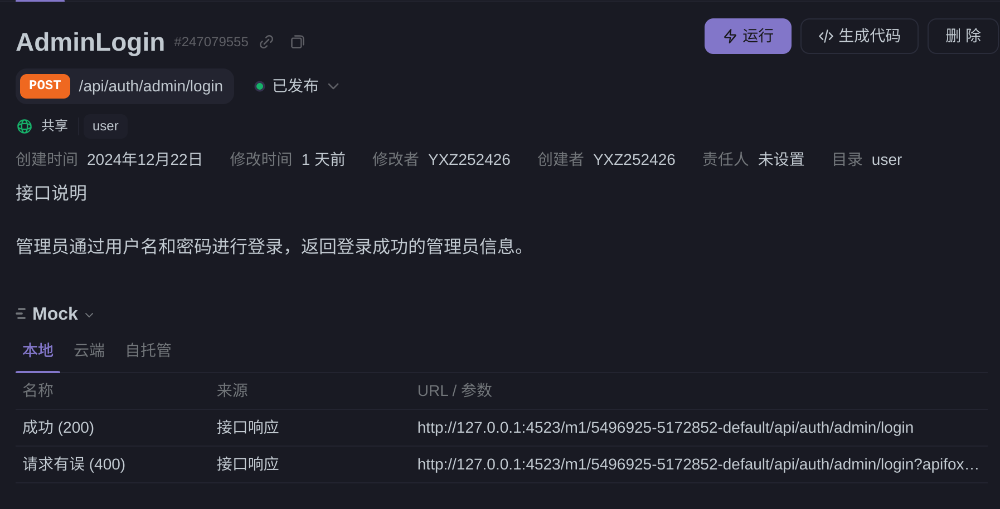

# swagger生成api文档
首先，要给各个服务的handler写注释，在 `route/biz/handler`目录下

## 具体案例
```go
package main
// Register
// @Summary Register
// @Description 注册新用户，返回用户基本信息
// @Tags user
// @Accept json
// @Produce json
// @Param request body user.RegisterRequest true "Register user request"
// @Success 200 {string} string "User registered successfully"
// @Failure 400 {string} string "Invalid request or validation failed"
// @router /api/auth/register [POST]
func Register(ctx context.Context, c *app.RequestContext) {
	var err error
	var req user.RegisterRequest
	err = c.BindAndValidate(&req)
	if err != nil {
		c.String(consts.StatusBadRequest, err.Error())
		return
	}

	rpcReq := userrpc.NewRegisterRequest()
	rpcReq.Username = req.Username
	rpcReq.Password = req.Password
	rpcReq.Email = req.Email
	rpcReq.Role = req.Role

	//log.Println("rpcReq: ", rpcReq)

	resp, err := rpc.UserClient.Register(ctx, rpcReq)

	if err != nil {
		var errResp *baserpc.ErrorResponse
		log.Println("rpc error: ", err)
		// TODO: handle error
		if errors.As(err, &errResp) {
			c.String(int(errResp.Code), errResp.Message)
		}
		return
	}
	c.JSON(consts.StatusOK, resp)
}

```
其中一个注释应该遵循这样的格式 `// @Summary Register`

更详细的注释格式可以参考 [更多注释](https://github.com/swaggo/swag/blob/master/README.md#declarative-comments-format)

## 注释分析
接下来分析用到的注释以及在apifox的效果
1. `// @Summary Register`

    意义: 标注这个接口的名称或主要功能，方便在文档中快速识别。
2. `// @Description 注册新用户，返回用户基本信息`

    作用: 对接口功能进行详细描述。

3. `// @Tags user`

   意义: 便于文档管理和组织，通常用于将接口按模块分组（例如 user 模块）。
4. `// @Accept json`

    作用: 指定该接口接受的数据格式。

5. `// @Produce json`
   
    作用: 指定该接口返回的数据格式。
6. `// @Param request body user.RegisterRequest true "Register user request"`

    作用: 定义接口的参数。
   
    request: 参数名称。
   
    body: 参数的位置（body 表示请求体）。
   
    user.RegisterRequest: 参数的数据结构类型。
    
    true: 参数是否必填。
    
    "Register user request": 对参数的描述。

7. `// @Success 200 {string} string "User registered successfully"`
   
    作用: 定义成功响应的格式和内容。
   
    200: HTTP 状态码。
   
    {string}: 响应的数据类型。
   
    string: 数据结构说明（这里是简单的字符串）。
   
    "User registered successfully": 示例响应内容。

8. `// @Failure 400 {string} string "Invalid request or validation failed"`
   
   作用: 定义失败响应的格式和内容。
   
    400: HTTP 状态码。
   
    {string}: 响应的数据类型。
   
    string: 数据结构说明。
 
9. `// @router /api/auth/register [POST]`
   
   作用: 定义接口的路由路径及其方法。
## 效果
 